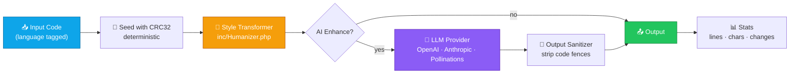

<div align="center">


<br/><br/>

```
       ⚡  Code Style Transformation Engine  ⚡
```

<br/>

**H-Code** rewrites AI-generated source into code that *reads* like a human wrote it —
preserving syntax, behavior, and intent while restoring the natural inconsistency
real developers leave behind.

<br/>

[]()
[]()
[]()
[]()
[]()
[]()

<br/>

[**Demo**](#-demo) · [**Quick Start**](#-quick-start) · [**API**](#-api-reference) · [**How It Works**](#-how-it-works) · [**Ethics**](#-responsible-use)

<br/>

---

<sub>Built with PHP, vanilla JS, and a healthy respect for the LLM token budget.</sub>

</div>

<br/>

## 📑 Table of Contents

- [✨ Features](#-features)
- [🧠 How It Works](#-how-it-works)
- [🏗 Architecture](#-architecture)
- [🌍 Supported Languages](#-supported-languages)
- [🚀 Quick Start](#-quick-start)
- [⚙️ Configuration](#️-configuration)
- [🖥 Web UI](#-web-ui)
- [🔌 API Reference](#-api-reference)
- [📚 PHP Library](#-php-library)
- [🎚 Intensity Levels](#-intensity-levels)
- [🔬 Transformations Applied](#-transformations-applied)
- [🐞 Troubleshooting](#-troubleshooting)
- [⚖️ Responsible Use](#-responsible-use)
- [📉 Limitations](#-limitations)
- [🗺 Roadmap](#-roadmap)
- [🤝 Contributing](#-contributing)
- [🧪 Testing](#-testing)
- [📄 License](#-license)
- [💬 Acknowledgments](#-acknowledgments)

<br/>

## ✨ Features

<table>
<tr>
<td width="50%">

### 🎨 Style Transformations
- **Inconsistent formatting** — `x+1` next to `x + 1`
- **Mixed naming conventions** — camelCase, snake_case, and `tmp` live together
- **Redundant parens** — `return (x + y)` because humans do that
- **Yoda conditions** — `if (null === x)` slips in naturally
- **Dead variables & debug logs** — what every dev forgets to remove
- **Commented-out branches** — `// tried this first, slower` left in place

</td>
<td width="50%">

### 🧰 Engine Capabilities
- **11 languages** — JS, TS, Python, C++, Java, PHP, C#, Go, Rust, Ruby, Swift
- **Optional AI rewrite** — OpenAI / Anthropic / Pollinations providers
- **Deterministic seed** — same input → same output
- **Tunable intensity** — 10 (light) → 100 (aggressive)
- **Diff & stats view** in the web UI
- **Pure PHP core** — no Composer, no Node, no build step

</td>
</tr>
</table>

<br/>

## 🎬 Demo

**Input** (AI-generated, suspiciously tidy):

```javascript
function calculateTotal(items) {
    let total = 0;
    for (let i = 0; i < items.length; i++) {
        const item = items[i];
        if (item.price > 0 && item.quantity > 0) {
            total += item.price * item.quantity;
        }
    }
    return total;
}
```

**Output** (H-Code, intensity 75):

```javascript
function calculateTotal(items) {
  // skipping items with zero price/qty, common edge case
  let total = 0
  for (let i = 0; i < items.length; i++) {
    const item = items[i];
    if (item.price > 0 && item.quantity > 0) {
        total = total + (item.price * item.quantity)
    }
  }
  // console.log("total was", total) // left from testing
  return (total);
}
```

> Same logic. Same output. Indentation wobbles, one stale debug line,
> a comment that names an actual variable. Looks like a Tuesday afternoon.

<br/>

## 🧠 How It Works

H-Code is a **two-stage pipeline**:

1. **Deterministic transformer** — applies language-aware style rules
   (variable substitutions, spacing variance, comment injection, etc.)
2. **Optional LLM rewriter** — sends the partially-styled code to a model
   with a strict prompt asking for *one more pass* of naturalism



<br/>

### Why two stages?

| Stage | Strength | Weakness |
|---|---|---|
| **Deterministic** | Reproducible, fast, free, no API key | Pattern becomes obvious if used alone |
| **LLM rewrite** | Adds non-repeating, contextual noise | Costs tokens, requires a key, can drift semantically |

Used together, the deterministic stage *primes* the code with realistic scaffolding
(variables, comments, formatting variance) so the LLM's pass focuses on subtler
human fingerprints instead of structural rewrites.

<br/>

## 🏗 Architecture

```
Hcode/
├── index.php              # Web UI (single-page app shell)
├── humanize.php           # REST endpoint (POST /humanize.php)
│
├── api/
│   ├── ai-humanize.php    # JSON proxy for AI engine
│   └── config.php         # Live config read/write
│
├── inc/
│   ├── Humanizer.php      # Core deterministic transformer (1014 LoC)
│   ├── AIEngine.php       # LLM provider router + prompt builder
│   └── Config.php         # JSON config wrapper
│
├── js/
│   └── app.js             # UI logic, diff view, theme toggle
│
├── css/
│   └── style.css          # Vanilla CSS, no framework
│
└── data/
    └── config.json        # Provider, model, API keys
```

<br/>

## 🌍 Supported Languages

| Language    | Key          | Debug stmt   | Comments | Whitespace |
|-------------|--------------|--------------|----------|------------|
| JavaScript  | `javascript` | `console.*`  | `//` `/* */` | insensitive |
| TypeScript  | `typescript` | `console.*`  | `//` `/* */` | insensitive |
| Python      | `python`     | `print()`    | `#` `''' '''` | **significant** |
| C++         | `cpp`        | `std::cout`  | `//` `/* */` | insensitive |
| Java        | `java`       | `System.out.*` | `//` `/* */` | insensitive |
| PHP         | `php`        | `var_dump`   | `//` `/* */` | insensitive |
| C#          | `csharp`     | `Console.*`  | `//` `/* */` | insensitive |
| Go          | `go`         | `fmt.*`      | `//` `/* */` | insensitive |
| Rust        | `rust`       | `println!`   | `//` `/* */` | insensitive |
| Ruby        | `ruby`       | `puts`       | `#` `=begin` | **significant** |
| Swift       | `swift`      | `print()`    | `//` `/* */` | insensitive |

<br/>

## 🚀 Quick Start

### Requirements

- **PHP 8.1+** with `curl` and `json` extensions
- A web server (Apache, Nginx, or PHP's built-in server for dev)
- *(Optional)* An API key from OpenAI, Anthropic, or a Pollinations endpoint

### Installation

```bash
# 1. Clone
git clone https://github.com/yourname/hcode.git
cd hcode

# 2. Make data writable
chmod 755 data/
chmod 644 data/config.json

# 3. Drop into your web root (or run the built-in server)
php -S localhost:8000
```

Open `http://localhost:8000` — paste code, pick a language, hit **Humanize**.

### Production (Apache)

```apache
<VirtualHost *:80>
    ServerName  hcode.local
    DocumentRoot /var/www/hcode
    <Directory /var/www/hcode>
        AllowOverride All
        Require all granted
    </Directory>
</VirtualHost>
```

### Production (Nginx)

```nginx
server {
    listen 80;
    server_name hcode.local;
    root /var/www/hcode;
    index index.php;

    location / {
        try_files $uri $uri/ /index.php?$query_string;
    }

    location ~ \.php$ {
        fastcgi_pass unix:/run/php/php8.1-fpm.sock;
        fastcgi_index index.php;
        include fastcgi_params;
        fastcgi_param SCRIPT_FILENAME $document_root$fastcgi_script_name;
    }
}
```

<br/>

## ⚙️ Configuration

Edit `data/config.json`:

```json
{
    "provider": "openai",
    "model": "gpt-4o",
    "api_key": "sk-...",
    "anthropic_key": "sk-ant-...",
    "anthropic_model": "claude-sonnet-4-20250514",
    "ai_enhance": true,
    "ai_temperature": 0.8
}
```

| Field | Default | Notes |
|---|---|---|
| `provider` | `pollinations` | `openai` · `anthropic` · `pollinations` |
| `model` | provider default | e.g. `gpt-4o`, `gpt-4o-mini`, `gpt-3.5-turbo` |
| `api_key` | *empty* | Required for OpenAI |
| `anthropic_key` | *empty* | Required for Anthropic |
| `anthropic_model` | `claude-sonnet-4-...` | Any current Claude model |
| `ai_enhance` | `true` | Disable for offline / deterministic-only mode |
| `ai_temperature` | `0.8` | 0 = robotic, 1+ = chaotic. Sweet spot: 0.7 – 0.9 |

> 🔒 **Security:** `data/config.json` may contain API keys. Never commit it.
> Add it to `.gitignore` and rotate keys if the file is ever exposed.

<br/>

## 🖥 Web UI

The UI is a single page (`index.php` + `css/style.css` + `js/app.js`).
It ships with:

- 🎨 **Dual-theme** (light / dark, system-aware)
- 📑 **Three tabs** — Input, Output, Diff
- ⚙️ **Live config panel** — switch providers, tweak temperature
- 📊 **Real-time stats** — line count delta, char count, change count
- 🔁 **Re-roll** — regenerate with a new seed
- 📋 **One-click copy** of the output
- 🔊 **Subtle noise overlay** for that 2024 "designed by a designer" feel

Keyboard shortcuts:

| Key | Action |
|---|---|
| `Ctrl/⌘ + Enter` | Run humanizer |
| `Ctrl/⌘ + K` | Clear input |
| `Ctrl/⌘ + D` | Toggle theme |

<br/>

## 🔌 API Reference

### `POST /humanize.php`

Transform code via the deterministic engine. No LLM call.

**Request**

```json
{
  "code": "function add(a, b) { return a + b; }",
  "language": "javascript",
  "intensity": 60
}
```

**Response**

```json
{
  "success": true,
  "original": "function add(a, b) { return a + b; }",
  "humanized": "function add(a, b) {\n  return (a + b)\n}",
  "language": "javascript",
  "intensity": 60,
  "changes": 1,
  "execution_time": "4.21ms",
  "stats": {
    "original_lines": 1,
    "humanized_lines": 3,
    "original_chars": 38,
    "humanized_chars": 47
  }
}
```

### `POST /api/ai-humanize.php`

Send code through the configured LLM provider.

**Request**

```json
{
  "code": "def greet(name):\n    print(f'Hello {name}')",
  "language": "python",
  "intensity": 70
}
```

**Response**

```json
{
  "success": true,
  "humanized": "def greet(name):\n    # quick greet\n    print(f'Hello {name}')  # works\n",
  "model": "gpt-4o",
  "tokens_used": 142
}
```

### `GET /api/config.php`

Returns the current (sanitized) configuration — keys are stripped.

### `POST /api/config.php`

```json
{
  "provider": "anthropic",
  "anthropic_model": "claude-sonnet-4-20250514",
  "ai_enhance": true,
  "ai_temperature": 0.85
}
```

### Error codes

| Status | Meaning |
|---|---|
| `400` | Missing field, invalid language, empty code, code > 100KB |
| `405` | Wrong HTTP method |
| `500` | Upstream LLM error or transformation failure |

<br/>

### cURL example

```bash
curl -X POST http://localhost:8000/humanize.php \
  -H "Content-Type: application/json" \
  -d '{
    "code": "const sum = (a, b) => a + b;",
    "language": "javascript",
    "intensity": 80
  }'
```

<br/>

## 📚 PHP Library

Use the deterministic engine in your own code — no HTTP, no LLM.

```php
<?php
require_once __DIR__ . '/inc/Humanizer.php';

$h = new Humanizer(['version' => '2.0.0', 'max_code_length' => 100000]);

$out = $h->humanize(
    code:     'def add(a, b):\n    return a + b',
    language: 'python',
    intensity: 65
);

echo $out;
```

Or with the LLM rewriter:

```php
<?php
require_once __DIR__ . '/inc/AIEngine.php';

$engine = new AIEngine('openai');
$result = $engine->humanize($code, 'typescript', 75);

// $result = ['text' => '...', 'tokens' => 0]
```

<br/>

## 🎚 Intensity Levels

| Range | Profile | What you get |
|---|---|---|
| `10 – 30` | **Light** | Subtle spacing variance, maybe one comment |
| `30 – 55` | **Moderate** | Mixed naming, parens, 1-2 debug artifacts |
| `55 – 80` | **Strong** | Multiple inconsistencies, dead vars, more comments |
| `80 – 100` | **Aggressive** | "Tired developer at 2am" — messy but functional |

> Intensity is a **hint**, not a hard target. The LLM is told:
> *"be inconsistent — do not apply the same transformation to every line."*

<br/>

## 🔬 Transformations Applied

The deterministic stage applies a configurable subset of these techniques
based on the chosen intensity:

<details>
<summary><b>Click to expand the full list (12 techniques)</b></summary>

<br/>

| # | Technique | Description |
|---|---|---|
| 1 | **Syntax equivalence** | Swaps `let` ↔ `const` ↔ `var`, `==` ↔ `===`, ternary ↔ `if/else` |
| 2 | **Spacing variance** | `x+1` vs `x + 1`, sometimes trailing whitespace |
| 3 | **String delimiters** | Mixes `'...'` and `"..."` randomly |
| 4 | **Naming drift** | Replaces names with `tmp`, `x`, or longer context-fitting alternatives |
| 5 | **Redundant parens** | Adds parens around return values and conditions |
| 6 | **Yoda conditions** | `if (null === x)` instead of `if (x === null)` |
| 7 | **Debug logs** | Inserts forgotten `console.log` / `print` calls |
| 8 | **Commented branches** | `// was using X, changed my mind` style |
| 9 | **Dead variables** | Assignments that look like dev testing leftovers |
| 10 | **Comment injection** | Context-aware comments naming actual variables |
| 11 | **Quote inconsistency** | Same string literal written both ways in one file |
| 12 | **Whitespace wobble** | Indentation shifts ±1 space on random lines |

</details>

<br/>

## 🐞 Troubleshooting

<details>
<summary><b>❌ "Method not allowed"</b></summary>

You're sending `GET` to an endpoint that only accepts `POST` (or vice-versa).
Use:

```bash
curl -X POST http://localhost:8000/humanize.php ...
```

</details>

<details>
<summary><b>❌ "Invalid language"</b></summary>

Check the [Supported Languages](#-supported-languages) table — keys are lowercase
and the C-family languages don't have dots (`csharp`, not `c#`).

</details>

<details>
<summary><b>❌ "Humanization failed"</b></summary>

Usually one of:

1. **`data/config.json` not writable** — `chmod 755 data/`
2. **API key missing** — paste it in the settings cog
3. **Curl timeout** — the LLM took too long; try `ai_enhance: false`
4. **Code contains a syntax error in the input** — the LLM can't rewrite garbage

</details>

<details>
<summary><b>❌ "Code too long (max 100KB)"</b></summary>

The `max_code_length` in `data/config.json` defaults to 100,000 characters.
Bump it if you need to humanize large files — but the LLM will struggle past ~2K
tokens regardless.

</details>

<details>
<summary><b>❌ Output has weird markdown fences</b></summary>

The LLM sometimes wraps its output in ```` ```js ... ``` ```` even when told not to.
The sanitizer strips them, but if you see leftovers, the prompt has regressed —
check `inc/AIEngine.php` line ~47.

</details>

<br/>

## ⚖️ Responsible Use

> **H-Code is a code style transformation tool.**
> It changes *how* code looks, never *what* it does.

H-Code exists to explore how code style signals authorship, and to demonstrate
stylistic transformations on text. The same techniques have legitimate uses in
code obfuscation research, educational tooling, and red-team / blue-team
exercises around AI-assisted developer workflows.

**Don't use H-Code to:**

- ❌ Submit AI-generated work in academic courses that ban it
- ❌ Violate employer policies on AI-assisted code
- ❌ Misrepresent authorship in open-source contributions
- ❌ Bypass code-origin audits in regulated environments

**Do use H-Code to:**

- ✅ Learn how code style conveys authorship signals
- ✅ Build detection / compliance tooling of your own
- ✅ Stress-test your own AI detector
- ✅ Refactor code style for a team standard

If your school, employer, or client has rules about disclosing AI assistance,
**follow those rules.** H-Code is not a license to break them.

<br/>

## 📉 Limitations

- 🧠 **The LLM may hallucinate** — always diff the output before trusting it
- 🎯 **AI detectors are an arms race** — no transformation is permanently
  undetectable; results vary by detector and over time
- 📐 **Whitespace-sensitive languages** (Python, Ruby) get fewer transformations
  because messing with indent breaks them
- 🔁 **Same input = same output** — the seed is `crc32($code)`. To get a new
  result, tweak a single character first
- 💸 **AI enhance costs tokens** — a 500-line file ≈ 2-4K input + 2-4K output

<br/>

## 🗺 Roadmap

- [ ] Pluggable transformer pipeline (custom user-defined rules)
- [ ] Batch endpoint (array of code blocks in one request)
- [ ] CLI binary (`./hcode humanize file.py --lang python --intensity 70`)
- [ ] Webhook callback for long-running LLM jobs
- [ ] Detector round-trip score (run output through 3-5 detectors, report)
- [ ] VS Code extension
- [ ] Docker image
- [ ] Pluggable language configs (add Kotlin, Scala, Elixir)

<br/>

## 🤝 Contributing

Pull requests welcome. A few guidelines:

1. **Fork & branch** from `main`
2. **Don't add new "undetectability" marketing claims** to the README — the
   project is intentionally framed as a *style transformation engine*
3. **Keep `inc/Humanizer.php` deterministic** — anything stochastic should
   go through the seeded `mt_srand` so the same input still produces the
   same output
4. **Add a test** in `tests/` for any new transformation technique
5. **Run** `php -l` on every changed `.php` file before pushing

<br/>

## 🧪 Testing

```bash
# Lint
php -l inc/Humanizer.php
php -l inc/AIEngine.php
php -l humanize.php

# Smoke test (requires PHP built-in server running on :8000)
php tests/smoke.php
```

The smoke test sends a known input through `/humanize.php` and asserts that:

- The response is valid JSON with `success: true`
- The output is **different** from the input
- The output is **syntactically valid** (parses in the target language)

<br/>

## 📄 License

[MIT](./LICENSE) — do whatever you want, just keep the copyright notice.

If you fork and rebrand, please change the project name. It makes the
"is this a fork or the original?" question easier to answer.

<br/>

## 💬 Acknowledgments

- The open-source maintainers of every language runtime H-Code targets
- The model providers (OpenAI, Anthropic, Pollinations) for keeping inference cheap
- Everyone who has ever left a `console.log` in production — you are the muse

<br/>

---

<div align="center">

<sub>

Made with ⚡ and probably too much caffeine.

If H-Code helped you learn something, a ⭐ is appreciated.

</sub>

<br/>

**[⬆ Back to top](#)**

</div>
